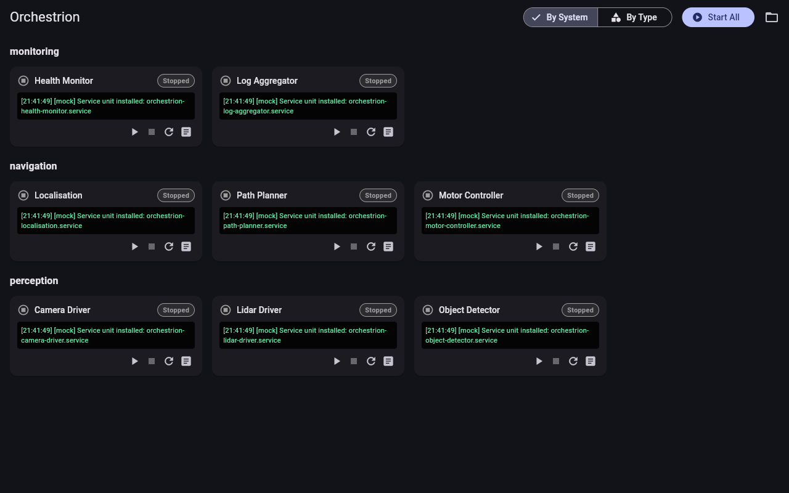

# Orchestrion

A Flutter UI for managing multiple `systemd` services from one place.

Load a YAML config, see all your services at a glance, and start/stop/restart them individually or all at once — with colour-coded status and live log output.

**[Live demo on GitHub Pages](https://CraigBuilds.github.io/Orchestrion/)** (uses mock services)

## Screenshot



## Features

- **Config-driven**: define services in a simple YAML file
- **Command + ROS shorthand**: supports generic commands and `ros2 run` shorthand
- **At-a-glance overview**: colour-coded service status (running / stopped / failed)
- **Grouping**: view services grouped by system or by service type
- **Start All**: one-click to start all enabled services
- **Log viewing**: inline log preview per service, plus a dedicated full-screen log viewer
- **Cross-platform**: runs on Linux desktop (real `systemd`) and web (mock service layer for demos)

## Quick start

```bash
# Install dependencies
flutter pub get

# Run on Linux desktop
flutter run -d linux

# Run on web (uses mock services)
flutter run -d chrome

# Run tests
flutter test
```

## Config format

Create a YAML file (see `example_config.yaml`):

```yaml
services:
  - name: Camera Driver
    system: perception
    service_type: sensor
    start_all: true
    command: "python3 /opt/drivers/camera_driver.py"

  - name: Lidar Driver
    system: perception
    service_type: sensor
    start_all: true
    ros:
      package: lidar_driver
      executable: lidar_node
      args: "--frequency 10"
```

Each service needs:
- `name` — display name
- `system` — which system it belongs to (for grouping)
- `service_type` — what kind of service it is (for grouping)
- `start_all` — whether to include in one-click Start All (default: `true`)
- Either `command` (generic) or `ros` shorthand (`package`, `executable`, optional `args`)

## Architecture

```
lib/
  main.dart                    # App entry point
  models/
    service_config.dart        # Config data model
    service_state.dart         # Runtime state + status enum
  services/
    service_manager.dart       # Abstract service interface
    mock_service_manager.dart  # Mock for web/testing
    systemd_service_manager.dart  # Real systemd implementation
    config_loader.dart         # YAML config parser
  providers/
    app_state.dart             # Central state (ChangeNotifier)
  screens/
    home_screen.dart           # Main dashboard
    log_screen.dart            # Full-screen log viewer
  widgets/
    service_card.dart          # Service status card
    service_group_view.dart    # Group of service cards
```

## Next steps

Sensible follow-up improvements (not built yet):

- **Persist config path**: remember the last loaded config file
- **Auto-load config**: load a default config on startup (e.g. from `~/.config/orchestrion/config.yaml`)
- **Real systemd integration toggle**: UI switch between mock and real service manager on desktop
- **Service dependency ordering**: define startup order between services
- **Search/filter**: filter services by name, system, or type
- **Notifications**: desktop notifications when a service fails
- **Config editor**: edit the config from within the app
- **Multi-select actions**: select multiple services for batch start/stop
- **Log search**: search within log output
- **Configurable poll interval**: adjust how often service status is refreshed
- **systemd journal filtering**: filter logs by severity level
